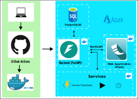

# DTBase
A starting point from which digital twins can be developed.

### What DTBase is

DTBase is a software package that developers can fork to develop their own digital twins with minimal effort. Digital twins mean quite different things to different people, and thus we should clarify. DTBase has
* A relational database, for holding both observational data (from e.g. sensors) and computational data (from models).
* A web server that wraps the database in a REST API. A user should never directly interact with the database, but rather through the API.
* A frontend web server, that provides a barebones graphical web user interface.
* An infrastructure-as-code configuration for deploying these resources on Azure.
* Tools for implementing your own "services", as DTBase calls them: Snippets of code that run periodically or on demand and interact with the backend API, such as data ingress functions or forecasting models.
* A few example services:
    * One to ingress weather data from OpenWeatherMap
    * One for running the Arima time series forecasting model
* Basic access control (user accounts and logins).
* Backend API endpoints, and for some of these frontend pages for easier interaction, for adding/editing/deleting
    * sensors, and inserting and retrieving data associated with sensors.
    * locations, and associating sensors with locations.
    * models, and inserting and retrieving data outputted by models. By this we mean simply "registering" a model with DTBase, not adding the code to actually run the model.
    * users. Separating users with different rights (e.g. admins) is currently unimplemented.
    * services. These are URLs that one can call to trigger a snippet of code to run, which may interact with the backend API. For instance ingress functions or models.

Some things DTBase does not, currently, have:
* Anything related to physical 3D structure of the objects that it is twinning. We have a very basic system for tracking locations in the twin, and for instance assigning sensors to locations, but this remains underdeveloped.
* Comprehensive visualisation tools. The frontend has basic time series plotting capabilities, but that's it.
* Sophisticated model orchestration. The services infrastructure can be used to store parameters for models and run them on demand, but the rest remains in development.
* Anything for using the digital twin to control the real asset.

DTBase may not be for you if
* Your idea of digital twin centres a CAD or Unity model of the thing being twinned.
* You need a plug-and-play, ready made software package that you `pip install` and run.

DTBase may be for you if
* Your idea of digital twin starts centres around a single data store with a unified interface, running models, and visualising data and model results from various sources on a web page.
* You want a codebase you can use as a starting point, and are willing to develop more bespoke features on top of it.

You may choose to only use parts of the infrastructure that DTBase offers. For instance, the frontend doesn't offer any functionality that the backend API doesn't have, so you can only use the backend, and develop your own frontend from scratch.

We have designed the codebase so that as many of DTBase's features as possible can be deployed either locally or via Azure. There is no reason that DTBase couldn't be deployed on other cloud services, but Azure is what we provide an infrastructure-as-code configuration for.

### Structure

The above diagram illustrates the different parts of DTBase, which one talks to which, and how the code gets deployed when you make edits. This assumes DTBase is deployed on Azure using the Pulumi infrastructure-as-code configuration in the `infrastructure` folder.

Each of the boxes on the right with the Docker symbol in the corner is a separate Docker container, built by a GitHub Action every time there's a new commit in the `main` branch, and pushed to Docker Hub, from where Azure loads it. Only the backend interacts with the database, everything else interacts with the backend. Services are here shown as Azure Functions, which is a convenient way to deploy your own services, but a service can also be any other external API endpoint that you can call to trigger something to run, hosted separately from your DTBase deployment.

The three Docker containers are defined by Docker files in the root folder, called `Dockerfile_backend`, `Dockerfile_frontend`, and `Dockerfile_functions`.

### Tech stack

* Most of the code is Python, except for browser stuff which is in Typescript and Jinja templates.
* The relational database is PostgreSQL.
* The backend is written in Python, using FastAPI and SQLAlchemy.
* The frontend is a Flask app written in Python.
* Continuous integration and continuous deployment are done via Github Actions, which in turn build Docker images and push them to Dockerhub.
* Infrastructure-as-code configuration is done using Pulumi.
* The example services (weather ingress, Arima) are implemented as Azure Functions.

### More Details

More documentation on the different parts of DTBase can be found in the following files.

* [DeveloperDocs.md](docs/DeveloperDocs.md) for how to run DTBase locally and set it up for development purposes.
* [dtbase_docs.md](docs/dtbase_docs.md) for detailed documentation of all aspects of DTBase.

### History/The CROP project

The DTBase package is based on [CROP](https://github.com/alan-turing-institute/CROP), a digital twin for an underground farm, located in a disused air-raid shelter in Clapham, London. Some of the defining aspects of the CROP digital twin are:
* Ingress of real-time sensor data.
* Ingress of data from other sources (weather, power consumption, information specific to the farm).
* Predictive models run on a daily schedule to give predictions and uncertainties for future conditions.
* Database containing all historic environmental and crop data.
* Web frontend including:
  - Dashboard showing at-a-glance overview of conditions in the farm.
  - Straightforward method of displaying and downloading time-series from selected data sources.
  - Custom visualizations of various operational aspects.
  - Visualizations of the predictive model outputs, including interactive scenario selection.
  - Interactive 3D model of the farm.

All of this makes use of cloud-based infrastructure, and can be easily deployed on Microsoft Azure using Pulumi.

DTBase grew out of the CROP codebase. It aims to replicate most (but not all) of the features of CROP, but generalize the code to be agnostic to the use case.
